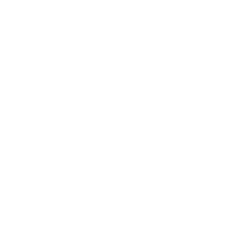

# AI Optima

"aioptima" is a Python library and contains a set of functions to facilitate data analysis and preprocessing steps. Thanks to these functions, feature engineering steps will be carried out very quickly.


## Installation

You can use pip to install the aioptima library:

```bash
  pip install aioptima
```

After running this command, the aioptima library and all its dependencies will be installed. Now you can use the library in your project.

You can also directly install the aioptima library from GitHub and add it to your project:
    
```bash
  https://github.com/Enes-CE/AIOptima.git
```
## Dependencies

The aioptima library is based on popular Python libraries such as pandas, numpy, scikit-learn, matplotlib and seaborn. These libraries must exist. If they are not installed, you can use the following commands to install them:

```bash
  pip install pandas 
  pip install numpy
  pip install scikit-learn
  pip install matplotlib 
  pip install seaborn
```

## Usage/Examples

```python
from aioptima import analys, visualize

df = analys.load_file("titanic", "csv")

analys.overview(df)

cat_cols, num_cols, cat_but_car, num_but_cat = analys.column_detection(df)
```


## Authors

- [@ibrahimenesulusoy](https://github.com/Enes-CE)


## 🔗 Links
[](https://ibrahimenesulusoy.com)
[](https://www.linkedin.com/in/ibrahim-enes-ulusoy-9646551b9/)
[](https://twitter.com/e_enesulusoy)
[](https://www.buymeacoffee.com/ibrahimenesulusoy)

## License

[MIT](https://choosealicense.com/licenses/mit/)


## Support

For support, email c.enes.eng@gmail.com

